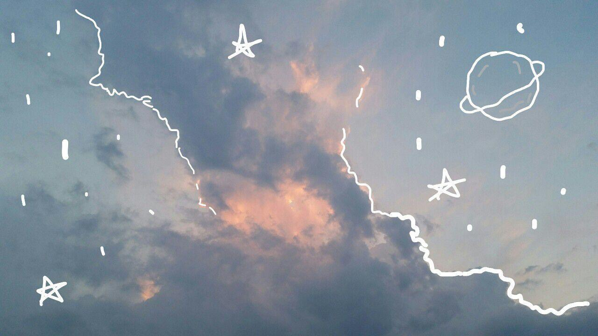

# Stella‘s Github

# Markdown 

# Lab 1 Page
### all Header 2 format text are used to check each markdown construct, will be removed afterwards.

## Styling text
**Hello, everyone! Welcome to my ~~beautiful~~ amazing github world! I am so _excited_ for CSE110**

## Quoting text
Don't know who says it, but I really like this quote
>Experience is the name everyone gives to their mistakes.

## quoting code
During the lab 1, I review a lot of git command, like `git add`, `git push`, and `git commit`.

## links
if you would like to see my lab 1, [here](https://jmastella.github.io/cse110-lab1) is the link.

## [Markdown tutorial](https://docs.github.com/en/free-pro-team@latest/github/writing-on-github/basic-writing-and-formatting-syntax)
I also learn a lot about markdown, and I feel like this tool is as powerful as html and css.

## Relative links
If you want to see my Read me file, [here](README.md) it is.

## Unordered Lists 
In my CSE140L class, my teammates are
-Stella
-Luna
-Vivian
I'm so excied about my new teammates in CSE110.

## Ordered List
### What am I going to do this weekend
1. Finish all lectures.
2. Do CSE105 homework, due Sunday.
3. Do CSE101 homework, due next Wednesday.
4. Read CSE101, 105, 151 textbook.
5. Finish work program.

## Nexted List
### For the work program
1. Do research on the it
    - TLS
    -JSSE
    -socket
2. Download jsse.jar
    -oracle
3. Finish the program
    -Finish it by Monday!!!!

## Task lists
Janurary 7th's Todo
- [x] Finish CSE110 Lab1
- [ ] Finish CSE105 lecture
- [ ] Finish CSE101 lecture
- [ ] Finish CSE101 reading quiz
- [ ] Finish CSE110 lecture

## Table
Before I am going to submit, I heard that we need a table.
<table>
<thead>
<tr>
<th>Name</th>
<th>Age</th>
</tr>
</thead>
<tbody>
<tr>
<td>Stella</td>
<td>20</td>
</tr>
<tr>
<td>Luna</td>
<td>25</td>
</tr>
</tbody>
</table>
